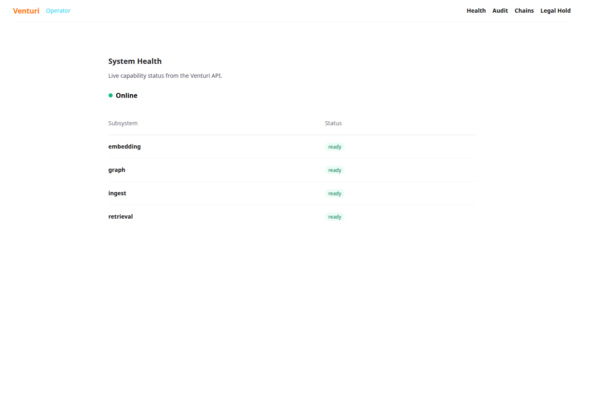

# Venturi portfolio demo

This repository includes a local-only operator-dashboard demonstration. It is
for showing the interface and development workflow; it is not a production
deployment and must never be described as a compliance demonstration.



## Run it locally

Use this only in a local development checkout.

```bash
cd ui
mix deps.get
VENTURI_UI_DEMO=true mix phx.server
```

Open `http://127.0.0.1:4000`. The demo flag bypasses OIDC only in the Phoenix
development configuration and supplies a fixed health fixture, so it cannot
enable a production bypass or display real customer data. To demonstrate a
live local API instead, omit `VENTURI_UI_DEMO` and configure
`VENTURI_API_URL` and `VENTURI_API_KEY`.

## What the screenshot demonstrates

- API-health and capability-status presentation rendered by Phoenix from a
  clearly labeled development fixture.
- The operator dashboard navigation for health, audit, chain references, and
  legal holds.
- The local, loopback-only integration pattern used by a self-hosted instance.

It does **not** demonstrate a production OIDC login, TLS termination, a BAA,
or HIPAA compliance. Those require a customer-controlled deployment and the
operational safeguards described in [HIPAA_READINESS.md](HIPAA_READINESS.md).
